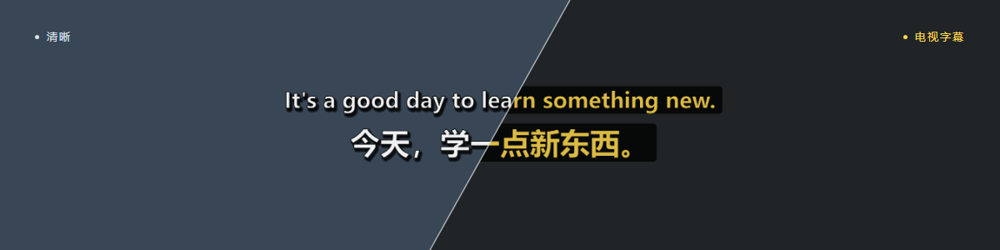
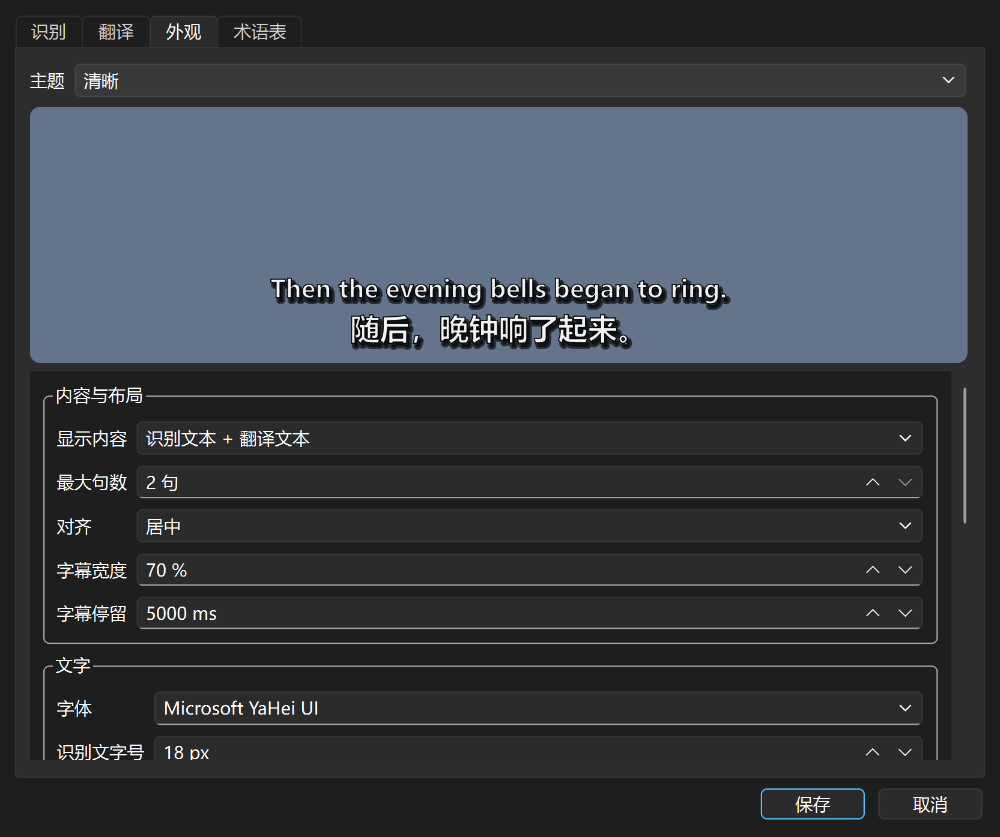
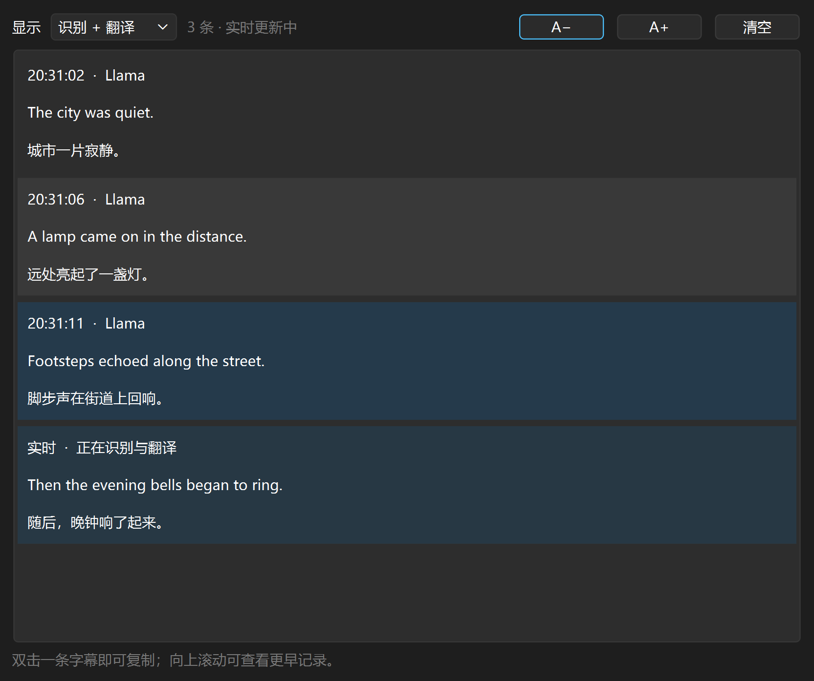

<h1 align="center">caption-lite · 实时字幕</h1>

<p align="center">将语音转为悬浮字幕，支持实时翻译与双语显示。</p>

<p align="center">
  
  
  <a href="LICENSE"></a>
</p>

<p align="center">
  
</p>

<table align="center">
  <tr>
    <td align="center" width="33%"><strong>只留字幕</strong><br><sub>悬浮置顶 · 锁定穿透</sub></td>
    <td align="center" width="33%"><strong>本地识别</strong><br><sub>默认使用 CPU · 模型按需下载</sub></td>
    <td align="center" width="33%"><strong>翻译自由选择</strong><br><sub>本地模型 · 在线服务</sub></td>
  </tr>
</table>

<details>
<summary>查看外观设置与字幕历史</summary>

<table>
  <tr>
    <td width="50%"><a href="docs/images/appearance.png"></a></td>
    <td width="50%"><a href="docs/images/history.png"></a></td>
  </tr>
  <tr>
    <td align="center">主题、字体与布局</td>
    <td align="center">原文译文对照，双击复制</td>
  </tr>
</table>

<sub>Windows 应用截图，使用演示文本。点击图片可查看大图。</sub>

</details>

<h2 align="center">开始使用</h2>

| 平台 | 音频来源 | 系统要求 |
| --- | --- | --- |
| Windows | 默认播放设备的系统声音 | Windows 10 / 11，64 位 |
| Android | 麦克风 | Android 17（API 37），arm64 |

**Windows**

1. 解压 `RealtimeSubtitle-portable.zip`，运行 `RealtimeSubtitle.exe`，无需安装 Python。
2. 按提示下载识别模型，然后播放音频。默认识别英语。
3. 右键托盘图标打开设置，选择翻译服务；只需原文时关闭翻译。

拖动字幕调整位置；<kbd>Ctrl</kbd> + <kbd>Alt</kbd> + <kbd>L</kbd> 锁定或解锁。
暂停、设置、历史和退出都在托盘菜单中。

**Android**

安装 APK 后授予麦克风权限，在设置中选择识别与翻译方式；需要悬浮字幕时开启悬浮窗权限。
支持系统识别或本地 Nemotron，翻译可选端侧模型或在线服务。详见 [Android 说明](android/README.md)。

<details>
<summary><strong>识别模型与翻译配置</strong></summary>

在 Windows 设置的“识别”页选择并下载模型：

| 模型 | 语言 | 下载量 |
| --- | --- | --- |
| Nemotron 560 ms（默认） | 英文 | 约 442 MiB |
| Nemotron 1120 ms | 英文，较长上下文 | 约 442 MiB |
| Nemotron 3.5 560 ms | 多语言，可自动识别语言 | 约 453 MiB |
| Zipformer INT8 | 中文 | 约 126 MiB |

英文 Nemotron 可选高精度模式，需要 NVIDIA GPU，另行下载约 5.5 GB 的组件与模型。
默认 INT8 模式无需显卡，也不会下载这些组件。

在“翻译”页填写服务配置后测试连接：

- **OpenAI 兼容接口 / llama.cpp**：填写 API 地址、模型及服务要求的密钥。
- **Google2**：自动获取网页组件调用密钥，通常无需填写；不要填 Google Cloud 项目密钥。
- **DeepL**：选择 API Free / Pro，填写对应密钥，也支持 `DEEPL_API_KEY` 环境变量。

术语表使用 `识别文本 = 目标译文` 格式。

</details>

> [!NOTE]
> Windows 识别在本机完成。在线翻译会发送识别文字，LLM 还会收到配置范围内的上下文与术语。
> Android 系统识别服务可能上传音频；本地 Nemotron 在设备上运行。

<h2 align="center">从源码构建</h2>

桌面端位于 `desktop/`，Android 位于 `android/`，两端独立构建。[开发约定](CONTRIBUTING.md)

<details>
<summary><strong>Windows · Python 3.12（64 位）</strong></summary>

在仓库根目录打开 PowerShell：

```powershell
cd desktop
.\tools\setup.ps1
.\tools\run.ps1
```

首次运行可在界面下载模型。生成便携版：

```powershell
.\tools\build.ps1
```

产物为 `desktop/dist/RealtimeSubtitle-portable.zip`。安装与打包使用桌面目录内的 `requirements-lock.txt` 固定依赖版本。

</details>

<details>
<summary><strong>Android · Linux / WSL 2，JDK 17</strong></summary>

准备 `curl` 和 `unzip`，在仓库根目录执行：

```bash
cd android
./tools/setup-wsl.sh
./tools/build-wsl.sh
```

设置脚本准备 SDK 和依赖。产物为 `android/app/build/outputs/apk/debug/app-debug.apk`。
这是调试包；正式发行需配置自己的签名。

</details>

<h2 align="center">许可证</h2>

<p align="center"><a href="LICENSE">MIT</a> · 第三方组件和下载模型保留各自许可，见 <a href="THIRD_PARTY_NOTICES.md">第三方声明</a>。</p>
